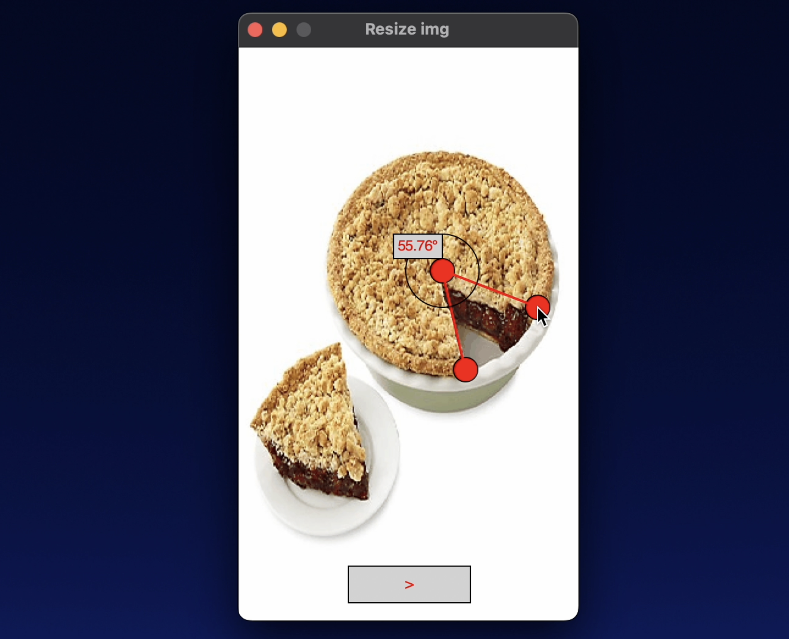

# findPieAngle

The goal is to take a photo of a pie with a slice taken out, knowing that the pan should be a circle if it weren't for perspective, and use that to figure out the angle of the slice. 

## Try out

Either download the repository to your computer or run git clone in your terminal.

```
git clone https://github.com/vietbuiminh/findPieAngle.git
```

If you use Spyder you can skip these step and just need to run straight from the IDE.

If not then,

Using conda to create new python environment.
```
conda create -n"angle" python=3.11  
```
```
conda activate angle
```
install dependencies 
```
pip install -r "requirements.txt"
```
run program by
```
python pieangle.py
```



